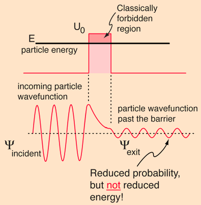
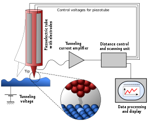

# Quantum Tunneling and Scanning Electron Microscope
## Quantum Tunneling
Due to the Heisenberg uncertainty principle, we are unable to fully know the exact location of a particle, and this uncertainty allows a particle to pass through an otherwise insurmountable potential barrier. 
The Heisenberg principle is below:

$$
\begin{aligned}
\sigma_x\sigma_p&= \frac{h}{4\pi}\\
\end{aligned}
$$

A particle can be visualised as both a wave and a particle. This can be seen as an interpretation of the Heisenberg Uncertainty principle, as the position and the momentum of the particle can never be precisely known, hence the probability of a given particle's existence on the other side of an opposing barrier is non-zero, and so there is a small probability of particles being found there, somehow overcoming the barrier without the requisite energy to do so.
To cross the otherwise insurmountable potential barrier, the particles "borrow" energy from the surroundings and to follow the law of conservation of energy, they return the extra energy in the form of more energetic reflected waves/particles. 

{: style="width:300px;display: block; margin: 0 auto"}

Consider particles moving towards a barrier. They act like a wave. This barrier compresses the wave, causing it to become taller and narrower, but some of the waves still manage to pass through the barrier, allowing for the probability of the particles to be found on the other side of the barrier to be low but non-zero, hence particles will be found on the other side of the barrier.
## Scanning Electron Microscope
A scanning electron microscope generally consists of a scanning tip, a piezoelectrically controlled height and lateral scanner, and a coarse approach mechanism to bring the tip to the sample. These components are controlled by a computer and supported by techniques which can prevent the vibrations from reaching the microscope. these items are often put in an airtight cylinder, and air will be removed to form a vacuum when in use.
{: style="width:300px;display: block; margin: 0 auto"}
During use, the coarse approach mechanism is used to bring the tip close to the sample. Afterwards, the piezoelectrically controlled scanner extends the tip, and a bias voltage is applied between the sample and the tip until a current is formed between the sample and the tip through quantum tunnelling. This typically occurs in the 0-4-0.7nm range, so the tip is kept at that distance from the sample. As the tip is moved across the surface, the current formed from tunnelling changes based on the height of the sample at that point, allowing the computer connected to the Scanning Tunneling Microscope to determine the shape and contour of the sample. Afterwards, the data will be generated in image form on the connected computer.

