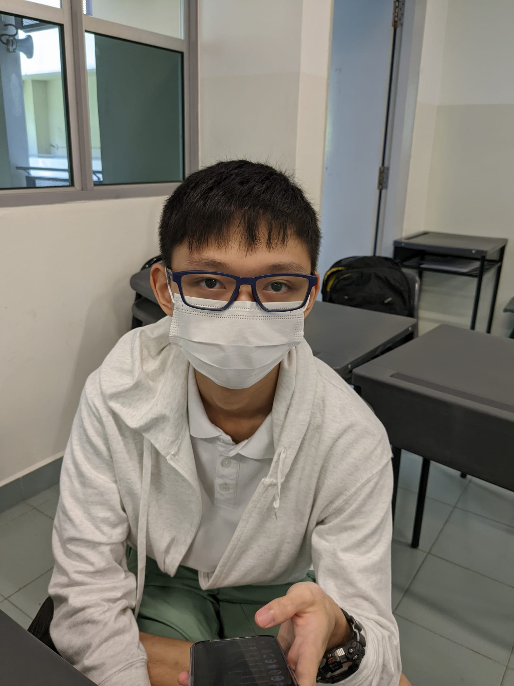
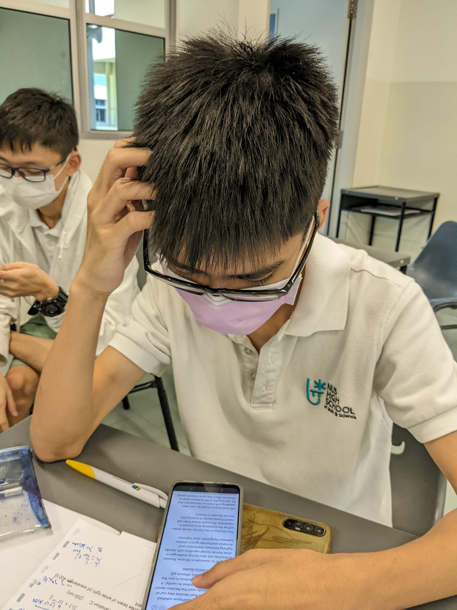

# About

## Information
This site was created by Karimi Zayan, Lim Lynus and Vernon Jude Pui Zhi Xian from M22505 for the PC5132 Advanced Physics IV module.

The site is about Heisenberg's uncertainty principle and its real-life applications. The site is intended for students of ages 18-21 with basic knowledge of calculus, classical physics and statistics and are keen to learn more

## About the authors

Zayan is an amazing person who has helped millions of people worldwide just by being alive. He shows care and empathy to everyone he talks to and has been described as "very  kind" by all of his friends. He loves physics and wants to teach people about math and physics.

Lynus is a jovial boy who loves playing the guitar and spending time with his girlfriends. When he is not drowning in female attention, Lynus is busy working on his homework and school life. He is committed to learning more and hopes that you enjoy this article.

Vernon has spent 3000 hours playing League of Legends. While he admits that he has wasted most of his life, Vernon is now deadset on being the best version of himself and improving himself. He spends a lot of the time at the gym and hopes to inspire people to change their lives.
