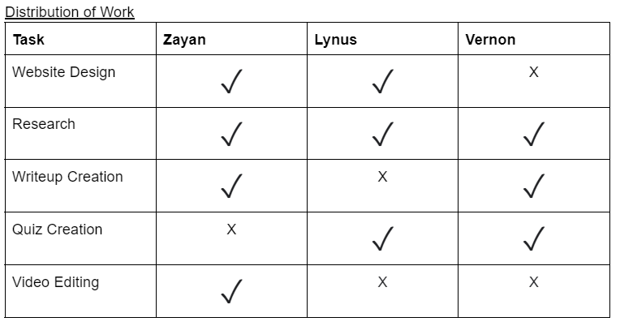

# Resources
Distribution of work can be found at the bottom of this page.

## References
1.   Sen, D. (2014). ["The Uncertainty relations in quantum mechanics"](http://www.currentscience.ac.in/Volumes/107/02/0203.pdf) (PDF). _Current Science_. **107** (2): 203–218.
2. Werner Heisenberg, Encounters with Einstein and Other Essays on People, Places and Particles, Published October 21st 1989 by Princeton University Press,p.53.
3.  M.Dolling, Lisa, et al., editors. The Tests of Time: Readings in the Development of Physical Theory. Princeton University Press, 2003, p. 412. [https://doi.org/10.2307/j.ctvcm4h07](https://doi.org/10.2307/j.ctvcm4h07).
4.   Kumar, Manjit. Quantum: Einstein, Bohr, and the great debate about the nature of reality / Manjit Kumar.—1st American ed., 2008. Chap.10,Note 37.
5.   Heisenberg, W. (1927), "Über den anschaulichen Inhalt der quantentheoretischen Kinematik und Mechanik", _[Zeitschrift für Physik](https://en.wikipedia.org/wiki/Zeitschrift_f%C3%BCr_Physik "Zeitschrift für Physik")_ (in German), **43** (3–4): 172–198, [Bibcode](https://en.wikipedia.org/wiki/Bibcode_(identifier) "Bibcode (identifier)"):[1927ZPhy...43..172H](https://ui.adsabs.harvard.edu/abs/1927ZPhy...43..172H), [doi](https://en.wikipedia.org/wiki/Doi_(identifier) "Doi (identifier)"):[10.1007/BF01397280](https://doi.org/10.1007%2FBF01397280), [S2CID](https://en.wikipedia.org/wiki/S2CID_(identifier) "S2CID (identifier)") [122763326](https://api.semanticscholar.org/CorpusID:122763326).. Annotated pre-publication proof sheet of [Über den anschaulichen Inhalt der quantentheoretischen Kinematik und Mechanik](http://scarc.library.oregonstate.edu/coll/pauling/bond/papers/corr155.1.html), March 21, 1927.
6.  Kennard, E. H. (1927), "Zur Quantenmechanik einfacher Bewegungstypen", _Zeitschrift für Physik_ (in German), **44** (4–5): 326–352, [Bibcode](https://en.wikipedia.org/wiki/Bibcode_(identifier) "Bibcode (identifier)"):[1927ZPhy...44..326K](https://ui.adsabs.harvard.edu/abs/1927ZPhy...44..326K), [doi](https://en.wikipedia.org/wiki/Doi_(identifier) "Doi (identifier)"):[10.1007/BF01391200](https://doi.org/10.1007%2FBF01391200), [S2CID](https://en.wikipedia.org/wiki/S2CID_(identifier) "S2CID (identifier)") [121626384](https://api.semanticscholar.org/CorpusID:121626384).
7.   Weyl, H. (1928), _Gruppentheorie und Quantenmechanik_, Leipzig: Hirzel
8.   Furuta, Aya (2012), ["One Thing Is Certain: Heisenberg's Uncertainty Principle Is Not Dead"](https://www.scientificamerican.com/article/heisenbergs-uncertainty-principle-is-not-dead/), _Scientific American_
9.  Ozawa, Masanao (2003), "Universally valid reformulation of the Heisenberg uncertainty principle on noise and disturbance in measurement", _Physical Review A_, **67** (4): 42105, [arXiv](https://en.wikipedia.org/wiki/ArXiv_(identifier) "ArXiv (identifier)"):[quant-ph/0207121](https://arxiv.org/abs/quant-ph/0207121), [Bibcode](https://en.wikipedia.org/wiki/Bibcode_(identifier) "Bibcode (identifier)"):[2003PhRvA..67d2105O](https://ui.adsabs.harvard.edu/abs/2003PhRvA..67d2105O), [doi](https://en.wikipedia.org/wiki/Doi_(identifier) "Doi (identifier)"):[10.1103/PhysRevA.67.042105](https://doi.org/10.1103%2FPhysRevA.67.042105), [S2CID](https://en.wikipedia.org/wiki/S2CID_(identifier) "S2CID (identifier)") [42012188](https://api.semanticscholar.org/CorpusID:42012188)
10.   Werner Heisenberg, _The Physical Principles of the Quantum Theory_, p. 20
11.  "Violation of Heisenberg's Measurement–Disturbance Relationship by Weak Measurements". _Physical Review Letters_. **109** (10): 100404. [arXiv](https://en.wikipedia.org/wiki/ArXiv_(identifier) "ArXiv (identifier)"):[1208.0034v2](https://arxiv.org/abs/1208.0034v2). [Bibcode](https://en.wikipedia.org/wiki/Bibcode_(identifier) "Bibcode (identifier)"):[2012PhRvL.109j0404R](https://ui.adsabs.harvard.edu/abs/2012PhRvL.109j0404R). [doi](https://en.wikipedia.org/wiki/Doi_(identifier) "Doi (identifier)"):[10.1103/PhysRevLett.109.100404](https://doi.org/10.1103%2FPhysRevLett.109.100404). [PMID](https://en.wikipedia.org/wiki/PMID_(identifier) "PMID (identifier)") [23005268](https://pubmed.ncbi.nlm.nih.gov/23005268). [S2CID](https://en.wikipedia.org/wiki/S2CID_(identifier) "S2CID (identifier)") [37576344](https://api.semanticscholar.org/CorpusID:37576344).
12.  [Indian Institute of Technology Madras, Professor V. Balakrishnan, Lecture 1 – Introduction to Quantum Physics; Heisenberg's uncertainty principle, National Programme of Technology Enhanced Learning](https://www.youtube.com/watch?v=TcmGYe39XG0) on [YouTube](https://en.wikipedia.org/wiki/YouTube "YouTube")
13.   [L.D. Landau](https://en.wikipedia.org/wiki/Lev_Landau "Lev Landau"), [E. M. Lifshitz](https://en.wikipedia.org/wiki/Evgeny_Lifshitz "Evgeny Lifshitz") (1977). _Quantum Mechanics: Non-Relativistic Theory_. Vol. 3 (3rd ed.). [Pergamon Press](https://en.wikipedia.org/wiki/Pergamon_Press "Pergamon Press"). [ISBN](https://en.wikipedia.org/wiki/ISBN_(identifier) "ISBN (identifier)") [978-0-08-020940-1](https://en.wikipedia.org/wiki/Special:BookSources/978-0-08-020940-1 "Special:BookSources/978-0-08-020940-1"). [Online copy](https://archive.org/details/QuantumMechanics_104).
14.  ["The Uncertainty Principle"](https://plato.stanford.edu/entries/qt-uncertainty/). _The Stanford Encyclopedia of Philosophy_. Metaphysics Research Lab, Stanford University. 2016.
15.  Elion, W. J.; Matters, M.; Geigenmüller, U.; Mooij, J. E. (1994), "Direct demonstration of Heisenberg's uncertainty principle in a superconductor", _Nature_, **371** (6498): 594–595, [Bibcode](https://en.wikipedia.org/wiki/Bibcode_(identifier) "Bibcode (identifier)"):[1994Natur.371..594E](https://ui.adsabs.harvard.edu/abs/1994Natur.371..594E), [doi](https://en.wikipedia.org/wiki/Doi_(identifier) "Doi (identifier)"):[10.1038/371594a0](https://doi.org/10.1038%2F371594a0), [S2CID](https://en.wikipedia.org/wiki/S2CID_(identifier) "S2CID (identifier)") [4240085](https://api.semanticscholar.org/CorpusID:4240085)
16.   Smithey, D. T.; M. Beck, J. Cooper, M. G. Raymer; Cooper, J.; Raymer, M. G. (1993), "Measurement of number–phase uncertainty relations of optical fields", _Phys. Rev. A_, **48** (4): 3159–3167, [Bibcode](https://en.wikipedia.org/wiki/Bibcode_(identifier) "Bibcode (identifier)"):[1993PhRvA..48.3159S](https://ui.adsabs.harvard.edu/abs/1993PhRvA..48.3159S), [doi](https://en.wikipedia.org/wiki/Doi_(identifier) "Doi (identifier)"):[10.1103/PhysRevA.48.3159](https://doi.org/10.1103%2FPhysRevA.48.3159), [PMID](https://en.wikipedia.org/wiki/PMID_(identifier) "PMID (identifier)") [9909968](https://pubmed.ncbi.nlm.nih.gov/9909968)
17.   Caves, Carlton (1981), "Quantum-mechanical noise in an interferometer", _Phys. Rev. D_, **23** (8): 1693–1708, [Bibcode](https://en.wikipedia.org/wiki/Bibcode_(identifier) "Bibcode (identifier)"):[1981PhRvD..23.1693C](https://ui.adsabs.harvard.edu/abs/1981PhRvD..23.1693C), [doi](https://en.wikipedia.org/wiki/Doi_(identifier) "Doi (identifier)"):[10.1103/PhysRevD.23.1693](https://doi.org/10.1103%2FPhysRevD.23.1693)
18. Jaeger, Gregg (September 2014). "What in the (quantum) world is macroscopic?". _American Journal of Physics_. **82** (9): 896–905. [Bibcode](https://en.wikipedia.org/wiki/Bibcode_(identifier) "Bibcode (identifier)"):[2014AmJPh..82..896J](https://ui.adsabs.harvard.edu/abs/2014AmJPh..82..896J). [doi](https://en.wikipedia.org/wiki/Doi_(identifier) "Doi (identifier)"):[10.1119/1.4878358](https://doi.org/10.1119%2F1.4878358).
19.   Claude Cohen-Tannoudji; Bernard Diu; Franck Laloë (1996), _Quantum mechanics_, Wiley-Interscience: Wiley, pp. 231–233, [ISBN](https://en.wikipedia.org/wiki/ISBN_(identifier) "ISBN (identifier)") [978-0-471-56952-7](https://en.wikipedia.org/wiki/Special:BookSources/978-0-471-56952-7 "Special:BookSources/978-0-471-56952-7")
20.   Giovannetti, V.; Lloyd, S.; Maccone, L. (2011). "Advances in quantum metrology". _Nature Photonics_. **5** (4): 222. [arXiv](https://en.wikipedia.org/wiki/ArXiv_(identifier) "ArXiv (identifier)"):[1102.2318](https://arxiv.org/abs/1102.2318). [Bibcode](https://en.wikipedia.org/wiki/Bibcode_(identifier) "Bibcode (identifier)"):[2011NaPho...5..222G](https://ui.adsabs.harvard.edu/abs/2011NaPho...5..222G). [doi](https://en.wikipedia.org/wiki/Doi_(identifier) "Doi (identifier)"):[10.1038/nphoton.2011.35](https://doi.org/10.1038%2Fnphoton.2011.35). [S2CID](https://en.wikipedia.org/wiki/S2CID_(identifier) "S2CID (identifier)") [12591819](https://api.semanticscholar.org/CorpusID:12591819).; [arXiv](https://arxiv.org/abs/1102.2318)
21. Luis, Alfredo (2017-03-13). "Breaking the weak Heisenberg limit". _Physical Review A_. **95** (3): 032113. [arXiv](https://en.wikipedia.org/wiki/ArXiv_(identifier) "ArXiv (identifier)"):[1607.07668](https://arxiv.org/abs/1607.07668). [Bibcode](https://en.wikipedia.org/wiki/Bibcode_(identifier) "Bibcode (identifier)"):[2017PhRvA..95c2113L](https://ui.adsabs.harvard.edu/abs/2017PhRvA..95c2113L). [doi](https://en.wikipedia.org/wiki/Doi_(identifier) "Doi (identifier)"):[10.1103/PhysRevA.95.032113](https://doi.org/10.1103%2FPhysRevA.95.032113). [ISSN](https://en.wikipedia.org/wiki/ISSN_(identifier) "ISSN (identifier)") [2469-9926](https://www.worldcat.org/issn/2469-9926). [S2CID](https://en.wikipedia.org/wiki/S2CID_(identifier) "S2CID (identifier)") [55838380](https://api.semanticscholar.org/CorpusID:55838380).
22.   Robertson, H. P. (1929), "The Uncertainty Principle", _Phys. Rev._, **34** (1): 163–64, [Bibcode](https://en.wikipedia.org/wiki/Bibcode_(identifier) "Bibcode (identifier)"):[1929PhRv...34..163R](https://ui.adsabs.harvard.edu/abs/1929PhRv...34..163R), [doi](https://en.wikipedia.org/wiki/Doi_(identifier) "Doi (identifier)"):[10.1103/PhysRev.34.163](https://doi.org/10.1103%2FPhysRev.34.163)
23.  Schrödinger, E. (1930), "Zum Heisenbergschen Unschärfeprinzip", _Sitzungsberichte der Preussischen Akademie der Wissenschaften, Physikalisch-mathematische Klasse_, **14**: 296–303
24.  Griffiths, David (2005), _Quantum Mechanics_, New Jersey: Pearson
25.  Riley, K. F.; M. P. Hobson and S. J. Bence (2006), _Mathematical Methods for Physics and Engineering_, Cambridge, p. 246
26.   Davidson, E. R. (1965), "On Derivations of the Uncertainty Principle", _J. Chem. Phys._, **42** (4): 1461–1462, [Bibcode](https://en.wikipedia.org/wiki/Bibcode_(identifier) "Bibcode (identifier)"):[1965JChPh..42.1461D](https://ui.adsabs.harvard.edu/abs/1965JChPh..42.1461D), [doi](https://en.wikipedia.org/wiki/Doi_(identifier) "Doi (identifier)"):[10.1063/1.1696139](https://doi.org/10.1063%2F1.1696139)
27.   Hall, B. C. (2013), _Quantum Theory for Mathematicians_, Springer, p. 245
28.   Jackiw, Roman (1968), "Minimum Uncertainty Product, Number-Phase Uncertainty Product, and Coherent States", _J. Math. Phys._, **9** (3): 339–346, [Bibcode](https://en.wikipedia.org/wiki/Bibcode_(identifier) "Bibcode (identifier)"):[1968JMP.....9..339J](https://ui.adsabs.harvard.edu/abs/1968JMP.....9..339J), [doi](https://en.wikipedia.org/wiki/Doi_(identifier) "Doi (identifier)"):[10.1063/1.1664585](https://doi.org/10.1063%2F1.1664585)
29.  Carruthers, P.; Nieto, M. M. (1968), "Phase and Angle Variables in Quantum Mechanics", _Rev. Mod. Phys._, **40** (2): 411–440, [Bibcode](https://en.wikipedia.org/wiki/Bibcode_(identifier) "Bibcode (identifier)"):[1968RvMP...40..411C](https://ui.adsabs.harvard.edu/abs/1968RvMP...40..411C), [doi](https://en.wikipedia.org/wiki/Doi_(identifier) "Doi (identifier)"):[10.1103/RevModPhys.40.411](https://doi.org/10.1103%2FRevModPhys.40.411)
30.  Hall, B. C. (2013), _Quantum Theory for Mathematicians_, Springer
31.  Maccone, Lorenzo; Pati, Arun K. (31 December 2014). "Stronger Uncertainty Relations for All Incompatible Observables". _Physical Review Letters_. **113** (26): 260401. [arXiv](https://en.wikipedia.org/wiki/ArXiv_(identifier) "ArXiv (identifier)"):[1407.0338](https://arxiv.org/abs/1407.0338). [Bibcode](https://en.wikipedia.org/wiki/Bibcode_(identifier) "Bibcode (identifier)"):[2014PhRvL.113z0401M](https://ui.adsabs.harvard.edu/abs/2014PhRvL.113z0401M). [doi](https://en.wikipedia.org/wiki/Doi_(identifier) "Doi (identifier)"):[10.1103/PhysRevLett.113.260401](https://doi.org/10.1103%2FPhysRevLett.113.260401). [PMID](https://en.wikipedia.org/wiki/PMID_(identifier) "PMID (identifier)") [25615288](https://pubmed.ncbi.nlm.nih.gov/25615288).
32. Huang, Yichen (10 August 2012). "Variance-based uncertainty relations". _Physical Review A_. **86** (2): 024101. [arXiv](https://en.wikipedia.org/wiki/ArXiv_(identifier) "ArXiv (identifier)"):[1012.3105](https://arxiv.org/abs/1012.3105). [Bibcode](https://en.wikipedia.org/wiki/Bibcode_(identifier) "Bibcode (identifier)"):[2012PhRvA..86b4101H](https://ui.adsabs.harvard.edu/abs/2012PhRvA..86b4101H). [doi](https://en.wikipedia.org/wiki/Doi_(identifier) "Doi (identifier)"):[10.1103/PhysRevA.86.024101](https://doi.org/10.1103%2FPhysRevA.86.024101). [S2CID](https://en.wikipedia.org/wiki/S2CID_(identifier) "S2CID (identifier)") [118507388](https://api.semanticscholar.org/CorpusID:118507388).
33. "Uncertainty relations with the variance and the quantum Fisher information based on convex decompositions of density matrices". _Physical Review Research_. **4** (1): 013075. [arXiv](https://en.wikipedia.org/wiki/ArXiv_(identifier) "ArXiv (identifier)"):[2109.06893](https://arxiv.org/abs/2109.06893). [Bibcode](https://en.wikipedia.org/wiki/Bibcode_(identifier) "Bibcode (identifier)"):[2022PhRvR...4a3075T](https://ui.adsabs.harvard.edu/abs/2022PhRvR...4a3075T). [doi](https://en.wikipedia.org/wiki/Doi_(identifier) "Doi (identifier)"):[10.1103/PhysRevResearch.4.013075](https://doi.org/10.1103%2FPhysRevResearch.4.013075). [S2CID](https://en.wikipedia.org/wiki/S2CID_(identifier) "S2CID (identifier)") [237513549](https://api.semanticscholar.org/CorpusID:237513549).
34.  Tóth, Géza; Petz, Dénes (20 March 2013). "Extremal properties of the variance and the quantum Fisher information". _Physical Review A_. **87** (3): 032324. [arXiv](https://en.wikipedia.org/wiki/ArXiv_(identifier) "ArXiv (identifier)"):[1109.2831](https://arxiv.org/abs/1109.2831). [Bibcode](https://en.wikipedia.org/wiki/Bibcode_(identifier) "Bibcode (identifier)"):[2013PhRvA..87c2324T](https://ui.adsabs.harvard.edu/abs/2013PhRvA..87c2324T). [doi](https://en.wikipedia.org/wiki/Doi_(identifier) "Doi (identifier)"):[10.1103/PhysRevA.87.032324](https://doi.org/10.1103%2FPhysRevA.87.032324). [S2CID](https://en.wikipedia.org/wiki/S2CID_(identifier) "S2CID (identifier)") [55088553](https://api.semanticscholar.org/CorpusID:55088553).
35.  Yu, Sixia (2013). "Quantum Fisher Information as the Convex Roof of Variance". [arXiv](https://en.wikipedia.org/wiki/ArXiv_(identifier) "ArXiv (identifier)"):[1302.5311](https://arxiv.org/abs/1302.5311) [[quant-ph](https://arxiv.org/archive/quant-ph)].
36. Fröwis, Florian; Schmied, Roman; Gisin, Nicolas (2 July 2015). "Tighter quantum uncertainty relations following from a general probabilistic bound". _Physical Review A_. **92** (1): 012102. [arXiv](https://en.wikipedia.org/wiki/ArXiv_(identifier) "ArXiv (identifier)"):[1409.4440](https://arxiv.org/abs/1409.4440). [Bibcode](https://en.wikipedia.org/wiki/Bibcode_(identifier) "Bibcode (identifier)"):[2015PhRvA..92a2102F](https://ui.adsabs.harvard.edu/abs/2015PhRvA..92a2102F). [doi](https://en.wikipedia.org/wiki/Doi_(identifier) "Doi (identifier)"):[10.1103/PhysRevA.92.012102](https://doi.org/10.1103%2FPhysRevA.92.012102). [S2CID](https://en.wikipedia.org/wiki/S2CID_(identifier) "S2CID (identifier)") [58912643](https://api.semanticscholar.org/CorpusID:58912643).
37.   Curtright, T.; Zachos, C. (2001). "Negative Probability and Uncertainty Relations". _Modern Physics Letters A_. **16** (37): 2381–2385. [arXiv](https://en.wikipedia.org/wiki/ArXiv_(identifier) "ArXiv (identifier)"):[hep-th/0105226](https://arxiv.org/abs/hep-th/0105226). [Bibcode](https://en.wikipedia.org/wiki/Bibcode_(identifier) "Bibcode (identifier)"):[2001MPLA...16.2381C](https://ui.adsabs.harvard.edu/abs/2001MPLA...16.2381C). [doi](https://en.wikipedia.org/wiki/Doi_(identifier) "Doi (identifier)"):[10.1142/S021773230100576X](https://doi.org/10.1142%2FS021773230100576X). [S2CID](https://en.wikipedia.org/wiki/S2CID_(identifier) "S2CID (identifier)") [119669313](https://api.semanticscholar.org/CorpusID:119669313).
38.  L. I. Mandelshtam, I. E. Tamm, [_The uncertainty relation between energy and time in nonrelativistic quantum mechanics_](http://daarb.narod.ru/mandtamm/index-eng.html), 1945.
39.   Hilgevoord, Jan (1996). ["The uncertainty principle for energy and time"](http://www.phy.pku.edu.cn/~qhcao/resources/class/QM_panel_13/ajp_uncert_energy_time1.pdf) (PDF). _American Journal of Physics_. **64** (12): 1451–1456. [Bibcode](https://en.wikipedia.org/wiki/Bibcode_(identifier) "Bibcode (identifier)"):[1996AmJPh..64.1451H](https://ui.adsabs.harvard.edu/abs/1996AmJPh..64.1451H). [doi](https://en.wikipedia.org/wiki/Doi_(identifier) "Doi (identifier)"):[10.1119/1.18410](https://doi.org/10.1119%2F1.18410).; Hilgevoord, Jan (1998). "The uncertainty principle for energy and time. II". _American Journal of Physics_. **66** (5): 396–402. [Bibcode](https://en.wikipedia.org/wiki/Bibcode_(identifier) "Bibcode (identifier)"):[1998AmJPh..66..396H](https://ui.adsabs.harvard.edu/abs/1998AmJPh..66..396H). [doi](https://en.wikipedia.org/wiki/Doi_(identifier) "Doi (identifier)"):[10.1119/1.18880](https://doi.org/10.1119%2F1.18880).; Busch, P. (1990). "On the energy-time uncertainty relation. Part I: Dynamical time and time indeterminacy", _Foundations of physics_ **20**(1), 1-32; Busch, P. (1990), "On the energy-time uncertainty relation. Part II: Pragmatic time versus energy indeterminacy". _Foundations of Physics_ **20**(1), 33-43.
40.  The broad linewidth of fast-decaying states makes it difficult to accurately measure the energy of the state, and researchers have even used detuned microwave cavities to slow down the decay rate, to get sharper peaks. Gabrielse, Gerald; H. Dehmelt (1985), "Observation of Inhibited Spontaneous Emission", _Physical Review Letters_, **55** (1): 67–70, [Bibcode](https://en.wikipedia.org/wiki/Bibcode_(identifier) "Bibcode (identifier)"):[1985PhRvL..55...67G](https://ui.adsabs.harvard.edu/abs/1985PhRvL..55...67G), [doi](https://en.wikipedia.org/wiki/Doi_(identifier) "Doi (identifier)"):[10.1103/PhysRevLett.55.67](https://doi.org/10.1103%2FPhysRevLett.55.67), [PMID](https://en.wikipedia.org/wiki/PMID_(identifier) "PMID (identifier)") [10031682](https://pubmed.ncbi.nlm.nih.gov/10031682)
41.   Likharev, K. K.; A. B. Zorin (1985), "Theory of Bloch-Wave Oscillations in Small Josephson Junctions", _J. Low Temp. Phys._, **59** (3/4): 347–382, [Bibcode](https://en.wikipedia.org/wiki/Bibcode_(identifier) "Bibcode (identifier)"):[1985JLTP...59..347L](https://ui.adsabs.harvard.edu/abs/1985JLTP...59..347L), [doi](https://en.wikipedia.org/wiki/Doi_(identifier) "Doi (identifier)"):[10.1007/BF00683782](https://doi.org/10.1007%2FBF00683782), [S2CID](https://en.wikipedia.org/wiki/S2CID_(identifier) "S2CID (identifier)") [120813342](https://api.semanticscholar.org/CorpusID:120813342)
42.   Anderson, P. W. (1964), "Special Effects in Superconductivity", in Caianiello, E. R. (ed.), _Lectures on the Many-Body Problem, Vol. 2_, New York: Academic Press
43.  Hall, B. C. (2013), _Quantum Theory for Mathematicians_, Springer, p. 245
44.  Hall, B. C. (2013), _Quantum Theory for Mathematicians_, Springer, p. 285
45.  Hall, B. C. (2013), _Quantum Theory for Mathematicians_, Springer, p. 246
46.  Busch, P.; Lahti, P.; Werner, R. F. (2013). "Proof of Heisenberg's Error-Disturbance Relation". _Physical Review Letters_. **111** (16): 160405. [arXiv](https://en.wikipedia.org/wiki/ArXiv_(identifier) "ArXiv (identifier)"):[1306.1565](https://arxiv.org/abs/1306.1565). [Bibcode](https://en.wikipedia.org/wiki/Bibcode_(identifier) "Bibcode (identifier)"):[2013PhRvL.111p0405B](https://ui.adsabs.harvard.edu/abs/2013PhRvL.111p0405B). [doi](https://en.wikipedia.org/wiki/Doi_(identifier) "Doi (identifier)"):[10.1103/PhysRevLett.111.160405](https://doi.org/10.1103%2FPhysRevLett.111.160405). [PMID](https://en.wikipedia.org/wiki/PMID_(identifier) "PMID (identifier)") [24182239](https://pubmed.ncbi.nlm.nih.gov/24182239). [S2CID](https://en.wikipedia.org/wiki/S2CID_(identifier) "S2CID (identifier)") [24507489](https://api.semanticscholar.org/CorpusID:24507489).
47.  Busch, P.; Lahti, P.; Werner, R. F. (2014). "Heisenberg uncertainty for qubit measurements". _Physical Review A_. **89** (1): 012129. [arXiv](https://en.wikipedia.org/wiki/ArXiv_(identifier) "ArXiv (identifier)"):[1311.0837](https://arxiv.org/abs/1311.0837). [Bibcode](https://en.wikipedia.org/wiki/Bibcode_(identifier) "Bibcode (identifier)"):[2014PhRvA..89a2129B](https://ui.adsabs.harvard.edu/abs/2014PhRvA..89a2129B). [doi](https://en.wikipedia.org/wiki/Doi_(identifier) "Doi (identifier)"):[10.1103/PhysRevA.89.012129](https://doi.org/10.1103%2FPhysRevA.89.012129). [S2CID](https://en.wikipedia.org/wiki/S2CID_(identifier) "S2CID (identifier)") [118383022](https://api.semanticscholar.org/CorpusID:118383022).
48. Erhart, J.; Sponar, S.; Sulyok, G.; Badurek, G.; Ozawa, M.; Hasegawa, Y. (2012). "Experimental demonstration of a universally valid error-disturbance uncertainty relation in spin measurements". _Nature Physics_. **8** (3): 185–189. [arXiv](https://en.wikipedia.org/wiki/ArXiv_(identifier) "ArXiv (identifier)"):[1201.1833](https://arxiv.org/abs/1201.1833). [Bibcode](https://en.wikipedia.org/wiki/Bibcode_(identifier) "Bibcode (identifier)"):[2012NatPh...8..185E](https://ui.adsabs.harvard.edu/abs/2012NatPh...8..185E). [doi](https://en.wikipedia.org/wiki/Doi_(identifier) "Doi (identifier)"):[10.1038/nphys2194](https://doi.org/10.1038%2Fnphys2194). [S2CID](https://en.wikipedia.org/wiki/S2CID_(identifier) "S2CID (identifier)") [117270618](https://api.semanticscholar.org/CorpusID:117270618).
49.  Baek, S.-Y.; Kaneda, F.; Ozawa, M.; Edamatsu, K. (2013). ["Experimental violation and reformulation of the Heisenberg's error-disturbance uncertainty relation"](https://www.ncbi.nlm.nih.gov/pmc/articles/PMC3713528). _Scientific Reports_. **3**: 2221. [Bibcode](https://en.wikipedia.org/wiki/Bibcode_(identifier) "Bibcode (identifier)"):[2013NatSR...3E2221B](https://ui.adsabs.harvard.edu/abs/2013NatSR...3E2221B). [doi](https://en.wikipedia.org/wiki/Doi_(identifier) "Doi (identifier)"):[10.1038/srep02221](https://doi.org/10.1038%2Fsrep02221). [PMC](https://en.wikipedia.org/wiki/PMC_(identifier) "PMC (identifier)") [3713528](https://www.ncbi.nlm.nih.gov/pmc/articles/PMC3713528). [PMID](https://en.wikipedia.org/wiki/PMID_(identifier) "PMID (identifier)") [23860715](https://pubmed.ncbi.nlm.nih.gov/23860715).
50.  Ringbauer, M.; Biggerstaff, D.N.; Broome, M.A.; Fedrizzi, A.; Branciard, C.; White, A.G. (2014). "Experimental Joint Quantum Measurements with Minimum Uncertainty". _Physical Review Letters_. **112** (2): 020401. [arXiv](https://en.wikipedia.org/wiki/ArXiv_(identifier) "ArXiv (identifier)"):[1308.5688](https://arxiv.org/abs/1308.5688). [Bibcode](https://en.wikipedia.org/wiki/Bibcode_(identifier) "Bibcode (identifier)"):[2014PhRvL.112b0401R](https://ui.adsabs.harvard.edu/abs/2014PhRvL.112b0401R). [doi](https://en.wikipedia.org/wiki/Doi_(identifier) "Doi (identifier)"):[10.1103/PhysRevLett.112.020401](https://doi.org/10.1103%2FPhysRevLett.112.020401). [PMID](https://en.wikipedia.org/wiki/PMID_(identifier) "PMID (identifier)") [24483993](https://pubmed.ncbi.nlm.nih.gov/24483993). [S2CID](https://en.wikipedia.org/wiki/S2CID_(identifier) "S2CID (identifier)") [18730255](https://api.semanticscholar.org/CorpusID:18730255).
51.  Björk, G.; Söderholm, J.; Trifonov, A.; Tsegaye, T.; Karlsson, A. (1999). "Complementarity and the uncertainty relations". _Physical Review_. **A60** (3): 1878. [arXiv](https://en.wikipedia.org/wiki/ArXiv_(identifier) "ArXiv (identifier)"):[quant-ph/9904069](https://arxiv.org/abs/quant-ph/9904069). [Bibcode](https://en.wikipedia.org/wiki/Bibcode_(identifier) "Bibcode (identifier)"):[1999PhRvA..60.1874B](https://ui.adsabs.harvard.edu/abs/1999PhRvA..60.1874B). [doi](https://en.wikipedia.org/wiki/Doi_(identifier) "Doi (identifier)"):[10.1103/PhysRevA.60.1874](https://doi.org/10.1103%2FPhysRevA.60.1874). [S2CID](https://en.wikipedia.org/wiki/S2CID_(identifier) "S2CID (identifier)") [27371899](https://api.semanticscholar.org/CorpusID:27371899).
52.  Fujikawa, Kazuo (2012). "Universally valid Heisenberg uncertainty relation". _Physical Review A_. **85** (6): 062117. [arXiv](https://en.wikipedia.org/wiki/ArXiv_(identifier) "ArXiv (identifier)"):[1205.1360](https://arxiv.org/abs/1205.1360). [Bibcode](https://en.wikipedia.org/wiki/Bibcode_(identifier) "Bibcode (identifier)"):[2012PhRvA..85f2117F](https://ui.adsabs.harvard.edu/abs/2012PhRvA..85f2117F). [doi](https://en.wikipedia.org/wiki/Doi_(identifier) "Doi (identifier)"):[10.1103/PhysRevA.85.062117](https://doi.org/10.1103%2FPhysRevA.85.062117). [S2CID](https://en.wikipedia.org/wiki/S2CID_(identifier) "S2CID (identifier)") [119640759](https://api.semanticscholar.org/CorpusID:119640759).
53. Judge, D. (1964), "On the uncertainty relation for angle variables", _Il Nuovo Cimento_, **31** (2): 332–340, [Bibcode](https://en.wikipedia.org/wiki/Bibcode_(identifier) "Bibcode (identifier)"):[1964NCim...31..332J](https://ui.adsabs.harvard.edu/abs/1964NCim...31..332J), [doi](https://en.wikipedia.org/wiki/Doi_(identifier) "Doi (identifier)"):[10.1007/BF02733639](https://doi.org/10.1007%2FBF02733639), [S2CID](https://en.wikipedia.org/wiki/S2CID_(identifier) "S2CID (identifier)") [120553526](https://api.semanticscholar.org/CorpusID:120553526)
54.  Bouten, M.; Maene, N.; Van Leuven, P. (1965), "On an uncertainty relation for angle variables", _Il Nuovo Cimento_, **37** (3): 1119–1125, [Bibcode](https://en.wikipedia.org/wiki/Bibcode_(identifier) "Bibcode (identifier)"):[1965NCim...37.1119B](https://ui.adsabs.harvard.edu/abs/1965NCim...37.1119B), [doi](https://en.wikipedia.org/wiki/Doi_(identifier) "Doi (identifier)"):[10.1007/BF02773197](https://doi.org/10.1007%2FBF02773197), [S2CID](https://en.wikipedia.org/wiki/S2CID_(identifier) "S2CID (identifier)") [122838645](https://api.semanticscholar.org/CorpusID:122838645)
55.  Louisell, W. H. (1963), "Amplitude and phase uncertainty relations", _Physics Letters_, **7** (1): 60–61, [Bibcode](https://en.wikipedia.org/wiki/Bibcode_(identifier) "Bibcode (identifier)"):[1963PhL.....7...60L](https://ui.adsabs.harvard.edu/abs/1963PhL.....7...60L), [doi](https://en.wikipedia.org/wiki/Doi_(identifier) "Doi (identifier)"):[10.1016/0031-9163(63)90442-6](https://doi.org/10.1016%2F0031-9163%2863%2990442-6)
56. DeWitt, B. S.; Graham, N. (1973), _The Many-Worlds Interpretation of Quantum Mechanics_, Princeton: Princeton University Press, pp. 52–53, [ISBN](https://en.wikipedia.org/wiki/ISBN_(identifier) "ISBN (identifier)") [0-691-08126-3](https://en.wikipedia.org/wiki/Special:BookSources/0-691-08126-3 "Special:BookSources/0-691-08126-3")
57.   Hirschman, I. I. Jr. (1957), "A note on entropy", _[American Journal of Mathematics](https://en.wikipedia.org/wiki/American_Journal_of_Mathematics "American Journal of Mathematics")_, **79** (1): 152–156, [doi](https://en.wikipedia.org/wiki/Doi_(identifier) "Doi (identifier)"):[10.2307/2372390](https://doi.org/10.2307%2F2372390), [JSTOR](https://en.wikipedia.org/wiki/JSTOR_(identifier) "JSTOR (identifier)") [2372390](https://www.jstor.org/stable/2372390).
58.  Beckner, W. (1975), "Inequalities in Fourier analysis", _[Annals of Mathematics](https://en.wikipedia.org/wiki/Annals_of_Mathematics "Annals of Mathematics")_, **102** (6): 159–182, [doi](https://en.wikipedia.org/wiki/Doi_(identifier) "Doi (identifier)"):[10.2307/1970980](https://doi.org/10.2307%2F1970980), [JSTOR](https://en.wikipedia.org/wiki/JSTOR_(identifier) "JSTOR (identifier)") [1970980](https://www.jstor.org/stable/1970980), [PMC](https://en.wikipedia.org/wiki/PMC_(identifier) "PMC (identifier)") [432369](https://www.ncbi.nlm.nih.gov/pmc/articles/PMC432369), [PMID](https://en.wikipedia.org/wiki/PMID_(identifier) "PMID (identifier)") [16592223](https://pubmed.ncbi.nlm.nih.gov/16592223).
59.   Bialynicki-Birula, I.; Mycielski, J. (1975), ["Uncertainty Relations for Information Entropy in Wave Mechanics"](http://projecteuclid.org/euclid.cmp/1103899297), _[Communications in Mathematical Physics](https://en.wikipedia.org/wiki/Communications_in_Mathematical_Physics "Communications in Mathematical Physics")_, **44** (2): 129–132, [Bibcode](https://en.wikipedia.org/wiki/Bibcode_(identifier) "Bibcode (identifier)"):[1975CMaPh..44..129B](https://ui.adsabs.harvard.edu/abs/1975CMaPh..44..129B), [doi](https://en.wikipedia.org/wiki/Doi_(identifier) "Doi (identifier)"):[10.1007/BF01608825](https://doi.org/10.1007%2FBF01608825), [S2CID](https://en.wikipedia.org/wiki/S2CID_(identifier) "S2CID (identifier)") [122277352](https://api.semanticscholar.org/CorpusID:122277352)
60. Huang, Yichen (24 May 2011). "Entropic uncertainty relations in multidimensional position and momentum spaces". _Physical Review A_. **83** (5): 052124. [arXiv](https://en.wikipedia.org/wiki/ArXiv_(identifier) "ArXiv (identifier)"):[1101.2944](https://arxiv.org/abs/1101.2944). [Bibcode](https://en.wikipedia.org/wiki/Bibcode_(identifier) "Bibcode (identifier)"):[2011PhRvA..83e2124H](https://ui.adsabs.harvard.edu/abs/2011PhRvA..83e2124H). [doi](https://en.wikipedia.org/wiki/Doi_(identifier) "Doi (identifier)"):[10.1103/PhysRevA.83.052124](https://doi.org/10.1103%2FPhysRevA.83.052124). [S2CID](https://en.wikipedia.org/wiki/S2CID_(identifier) "S2CID (identifier)") [119243096](https://api.semanticscholar.org/CorpusID:119243096).
61.  Chafaï, D. (2003), "Gaussian maximum of entropy and reversed log-Sobolev inequality", _Séminaire de Probabilités XXXVI_, Lecture Notes in Mathematics, vol. 1801, pp. 194–200, [arXiv](https://en.wikipedia.org/wiki/ArXiv_(identifier) "ArXiv (identifier)"):[math/0102227](https://arxiv.org/abs/math/0102227), [doi](https://en.wikipedia.org/wiki/Doi_(identifier) "Doi (identifier)"):[10.1007/978-3-540-36107-7_5](https://doi.org/10.1007%2F978-3-540-36107-7_5), [ISBN](https://en.wikipedia.org/wiki/ISBN_(identifier) "ISBN (identifier)") [978-3-540-00072-3](https://en.wikipedia.org/wiki/Special:BookSources/978-3-540-00072-3 "Special:BookSources/978-3-540-00072-3"), [S2CID](https://en.wikipedia.org/wiki/S2CID_(identifier) "S2CID (identifier)") [17795603](https://api.semanticscholar.org/CorpusID:17795603)
62.  Chiew, Shao-Hen; Gessner, Manuel (31 January 2022). "Improving sum uncertainty relations with the quantum Fisher information". _Physical Review Research_. **4** (1): 013076. [arXiv](https://en.wikipedia.org/wiki/ArXiv_(identifier) "ArXiv (identifier)"):[2109.06900](https://arxiv.org/abs/2109.06900). [Bibcode](https://en.wikipedia.org/wiki/Bibcode_(identifier) "Bibcode (identifier)"):[2022PhRvR...4a3076C](https://ui.adsabs.harvard.edu/abs/2022PhRvR...4a3076C). [doi](https://en.wikipedia.org/wiki/Doi_(identifier) "Doi (identifier)"):[10.1103/PhysRevResearch.4.013076](https://doi.org/10.1103%2FPhysRevResearch.4.013076). [S2CID](https://en.wikipedia.org/wiki/S2CID_(identifier) "S2CID (identifier)") [237513883](https://api.semanticscholar.org/CorpusID:237513883).
63.  Havin, V.; Jöricke, B. (1994), _The Uncertainty Principle in Harmonic Analysis_, Springer-Verlag
64.  Folland, Gerald; Sitaram, Alladi (May 1997), "The Uncertainty Principle: A Mathematical Survey", _Journal of Fourier Analysis and Applications_, **3** (3): 207–238, [doi](https://en.wikipedia.org/wiki/Doi_(identifier) "Doi (identifier)"):[10.1007/BF02649110](https://doi.org/10.1007%2FBF02649110), [MR](https://en.wikipedia.org/wiki/MR_(identifier) "MR (identifier)") [1448337](https://www.ams.org/mathscinet-getitem?mr=1448337), [S2CID](https://en.wikipedia.org/wiki/S2CID_(identifier) "S2CID (identifier)") [121355943](https://api.semanticscholar.org/CorpusID:121355943)
65.  Sitaram, A (2001) [1994], ["Uncertainty principle, mathematical"](https://www.encyclopediaofmath.org/index.php?title=Uncertainty_principle,_mathematical), _[Encyclopedia of Mathematics](https://en.wikipedia.org/wiki/Encyclopedia_of_Mathematics "Encyclopedia of Mathematics")_, [EMS Press](https://en.wikipedia.org/wiki/European_Mathematical_Society "European Mathematical Society")
66. Matt Hall, ["What is the Gabor uncertainty principle?"](https://agilescientific.com/blog/2014/1/15/what-is-the-gabor-uncertainty-principle.html)
67. Donoho, D.L.; Stark, P.B (1989). "Uncertainty principles and signal recovery". _SIAM Journal on Applied Mathematics_. **49** (3): 906–931. [doi](https://en.wikipedia.org/wiki/Doi_(identifier) "Doi (identifier)"):[10.1137/0149053](https://doi.org/10.1137%2F0149053).
68.  Terence Tao (2005), ["An uncertainty principle for cyclic groups of prime order"](https://arxiv.org/abs/math/0308286), _Mathematical Research Letters_, **12** (1): 121–127, [arXiv](https://en.wikipedia.org/wiki/ArXiv_(identifier) "ArXiv (identifier)"):[math/0308286](https://arxiv.org/abs/math/0308286), [doi](https://en.wikipedia.org/wiki/Doi_(identifier) "Doi (identifier)"):[10.4310/MRL.2005.v12.n1.a11](https://doi.org/10.4310%2FMRL.2005.v12.n1.a11), [S2CID](https://en.wikipedia.org/wiki/S2CID_(identifier) "S2CID (identifier)") [8548232](https://api.semanticscholar.org/CorpusID:8548232)
69. Amrein, W.O.; Berthier, A.M. (1977), "On support properties of _L__p_-functions and their Fourier transforms", _Journal of Functional Analysis_, **24** (3): 258–267, [doi](https://en.wikipedia.org/wiki/Doi_(identifier) "Doi (identifier)"):[10.1016/0022-1236(77)90056-8](https://doi.org/10.1016%2F0022-1236%2877%2990056-8).
70. Benedicks, M. (1985), "On Fourier transforms of functions supported on sets of finite Lebesgue measure", _J. Math. Anal. Appl._, **106** (1): 180–183, [doi](https://en.wikipedia.org/wiki/Doi_(identifier) "Doi (identifier)"):[10.1016/0022-247X(85)90140-4](https://doi.org/10.1016%2F0022-247X%2885%2990140-4)
71. Nazarov, F. (1994), "Local estimates for exponential polynomials and their applications to inequalities of the uncertainty principle type", _St. Petersburg Math. J._, **5**: 663–717
72.  Jaming, Ph. (2007), "Nazarov's uncertainty principles in higher dimension", _J. Approx. Theory_, **149** (1): 30–41, [arXiv](https://en.wikipedia.org/wiki/ArXiv_(identifier) "ArXiv (identifier)"):[math/0612367](https://arxiv.org/abs/math/0612367), [doi](https://en.wikipedia.org/wiki/Doi_(identifier) "Doi (identifier)"):[10.1016/j.jat.2007.04.005](https://doi.org/10.1016%2Fj.jat.2007.04.005), [S2CID](https://en.wikipedia.org/wiki/S2CID_(identifier) "S2CID (identifier)") [9794547](https://api.semanticscholar.org/CorpusID:9794547)
73.  Hardy, G.H. (1933), "A theorem concerning Fourier transforms", _Journal of the London Mathematical Society_, **8** (3): 227–231, [doi](https://en.wikipedia.org/wiki/Doi_(identifier) "Doi (identifier)"):[10.1112/jlms/s1-8.3.227](https://doi.org/10.1112%2Fjlms%2Fs1-8.3.227)
74.  Hörmander, L. (1991), "A uniqueness theorem of Beurling for Fourier transform pairs", _Ark. Mat._, **29** (1–2): 231–240, [Bibcode](https://en.wikipedia.org/wiki/Bibcode_(identifier) "Bibcode (identifier)"):[1991ArM....29..237H](https://ui.adsabs.harvard.edu/abs/1991ArM....29..237H), [doi](https://en.wikipedia.org/wiki/Doi_(identifier) "Doi (identifier)"):[10.1007/BF02384339](https://doi.org/10.1007%2FBF02384339), [S2CID](https://en.wikipedia.org/wiki/S2CID_(identifier) "S2CID (identifier)") [121375111](https://api.semanticscholar.org/CorpusID:121375111)
75.  Bonami, A.; Demange, B.; Jaming, Ph. (2003), "Hermite functions and uncertainty principles for the Fourier and the windowed Fourier transforms", _Rev. Mat. Iberoamericana_, **19**: 23–55, [arXiv](https://en.wikipedia.org/wiki/ArXiv_(identifier) "ArXiv (identifier)"):[math/0102111](https://arxiv.org/abs/math/0102111), [Bibcode](https://en.wikipedia.org/wiki/Bibcode_(identifier) "Bibcode (identifier)"):[2001math......2111B](https://ui.adsabs.harvard.edu/abs/2001math......2111B), [doi](https://en.wikipedia.org/wiki/Doi_(identifier) "Doi (identifier)"):[10.4171/RMI/337](https://doi.org/10.4171%2FRMI%2F337), [S2CID](https://en.wikipedia.org/wiki/S2CID_(identifier) "S2CID (identifier)") [1211391](https://api.semanticscholar.org/CorpusID:1211391)
76.  Hedenmalm, Haakan (2012), "Heisenberg's uncertainty principle in the sense of Beurling", _[Journal d'Analyse Mathématique](https://en.wikipedia.org/wiki/Journal_d%27Analyse_Math%C3%A9matique "Journal d'Analyse Mathématique")_, **118** (2): 691–702, [arXiv](https://en.wikipedia.org/wiki/ArXiv_(identifier) "ArXiv (identifier)"):[1203.5222](https://arxiv.org/abs/1203.5222), [Bibcode](https://en.wikipedia.org/wiki/Bibcode_(identifier) "Bibcode (identifier)"):[2012arXiv1203.5222H](https://ui.adsabs.harvard.edu/abs/2012arXiv1203.5222H), [doi](https://en.wikipedia.org/wiki/Doi_(identifier) "Doi (identifier)"):[10.1007/s11854-012-0048-9](https://doi.org/10.1007%2Fs11854-012-0048-9), [S2CID](https://en.wikipedia.org/wiki/S2CID_(identifier) "S2CID (identifier)") [54533890](https://api.semanticscholar.org/CorpusID:54533890)
77.  Demange, Bruno (2009), _Uncertainty Principles Associated to Non-degenerate Quadratic Forms_, Société Mathématique de France, [ISBN](https://en.wikipedia.org/wiki/ISBN_(identifier) "ISBN (identifier)") [978-2-85629-297-6](https://en.wikipedia.org/wiki/Special:BookSources/978-2-85629-297-6 "Special:BookSources/978-2-85629-297-6")
78.  ["Heisenberg / Uncertainty online exhibit"](https://history.aip.org/history/exhibits/heisenberg/). American Institute of Physics, Center for History of Physics. Retrieved 2019-10-16.
79. Michael Eckert, "Werner Heisenberg: controversial scientist", Physics World, December 2001. [http://physicsweb.org/articles/world/14/12/8/1](http://physicsweb.org/articles/world/14/12/8/1)
80.  Werner Heisenberg, "Encounters with Einstein and Other Essays on People, Places, and Particles", Princeton University Press, p.113, 1983.
81.  Werner Heisenberg, "Encounters with Einstein and Other Essays on People, Places, and Particles", Princeton University Press, p.28, 1983.
82.  Bohr, Niels; Noll, Waldemar (1958), "Atomic Physics and Human Knowledge", _American Journal of Physics_, New York: Wiley, **26** (8): 38, [Bibcode](https://en.wikipedia.org/wiki/Bibcode_(identifier) "Bibcode (identifier)"):[1958AmJPh..26..596B](https://ui.adsabs.harvard.edu/abs/1958AmJPh..26..596B), [doi](https://en.wikipedia.org/wiki/Doi_(identifier) "Doi (identifier)"):[10.1119/1.1934707](https://doi.org/10.1119%2F1.1934707)
83. Heisenberg, W., _Die Physik der Atomkerne_, Taylor & Francis, 1952, p. 30.
84.  Heisenberg, W. (1930), _Physikalische Prinzipien der Quantentheorie_ (in German), Leipzig: Hirzel English translation _The Physical Principles of Quantum Theory_. Chicago: University of Chicago Press, 1930.
85.   Cassidy, David; Saperstein, Alvin M. (2009), "Beyond Uncertainty: Heisenberg, Quantum Physics, and the Bomb", _Physics Today_, New York: Bellevue Literary Press, **63** (1): 185, [Bibcode](https://en.wikipedia.org/wiki/Bibcode_(identifier) "Bibcode (identifier)"):[2010PhT....63a..49C](https://ui.adsabs.harvard.edu/abs/2010PhT....63a..49C), [doi](https://en.wikipedia.org/wiki/Doi_(identifier) "Doi (identifier)"):[10.1063/1.3293416](https://doi.org/10.1063%2F1.3293416)
86. George Greenstein; Arthur Zajonc (2006). _The Quantum Challenge: Modern Research on the Foundations of Quantum Mechanics_. Jones & Bartlett Learning. [ISBN](https://en.wikipedia.org/wiki/ISBN_(identifier) "ISBN (identifier)") [978-0-7637-2470-2](https://en.wikipedia.org/wiki/Special:BookSources/978-0-7637-2470-2 "Special:BookSources/978-0-7637-2470-2").
87.  Tipler, Paul A.; Llewellyn, Ralph A. (1999), "5–5", [_Modern Physics_](https://archive.org/details/modernphysics0003tipl) (3rd ed.), W. H. Freeman and Co., [ISBN](https://en.wikipedia.org/wiki/ISBN_(identifier) "ISBN (identifier)") [1-57259-164-1](https://en.wikipedia.org/wiki/Special:BookSources/1-57259-164-1 "Special:BookSources/1-57259-164-1")
88.  Enz, Charles P.; Meyenn, Karl von, eds. (1994). [_Writings on physics and philosophy by Wolfgang Pauli_](https://books.google.com/books?id=ueTd4g7pc5MC&pg=PA43). Springer-Verlag. p. 43. [ISBN](https://en.wikipedia.org/wiki/ISBN_(identifier) "ISBN (identifier)") [3-540-56859-X](https://en.wikipedia.org/wiki/Special:BookSources/3-540-56859-X "Special:BookSources/3-540-56859-X"); translated by Robert Schlapp
89.   Feynman lectures on Physics, vol 3, 2–2
90. Gamow, G., _The great physicists from Galileo to Einstein_, Courier Dover, 1988, p.260.
91.  Kumar, M., _Quantum: Einstein, Bohr and the Great Debate About the Nature of Reality_, Icon, 2009, p. 282.
92. Gamow, G., _The great physicists from Galileo to Einstein_, Courier Dover, 1988, p. 260–261.
93.  Kumar, M., _Quantum: Einstein, Bohr and the Great Debate About the Nature of Reality_, Icon, 2009, p. 287.
94.  Isaacson, Walter (2007), [_Einstein: His Life and Universe_](https://archive.org/details/einsteinhislifeu0000isaa/page/452), New York: Simon & Schuster, p. [452](https://archive.org/details/einsteinhislifeu0000isaa/page/452), [ISBN](https://en.wikipedia.org/wiki/ISBN_(identifier) "ISBN (identifier)") [978-0-7432-6473-0](https://en.wikipedia.org/wiki/Special:BookSources/978-0-7432-6473-0 "Special:BookSources/978-0-7432-6473-0")
95.  Gerardus 't Hooft has at times advocated this point of view.
96.  Popper, Karl (1959), [_The Logic of Scientific Discovery_](https://en.wikipedia.org/wiki/The_Logic_of_Scientific_Discovery "The Logic of Scientific Discovery"), Hutchinson & Co.
97.  Jarvie, Ian Charles; Milford, Karl; Miller, David W (2006), _Karl Popper: a centenary assessment_, vol. 3, Ashgate Publishing, [ISBN](https://en.wikipedia.org/wiki/ISBN_(identifier) "ISBN (identifier)") [978-0-7546-5712-5](https://en.wikipedia.org/wiki/Special:BookSources/978-0-7546-5712-5 "Special:BookSources/978-0-7546-5712-5")
98. Popper, Karl; Carl Friedrich von Weizsäcker (1934), "Zur Kritik der Ungenauigkeitsrelationen (Critique of the Uncertainty Relations)", _Naturwissenschaften_, **22** (48): 807–808, [Bibcode](https://en.wikipedia.org/wiki/Bibcode_(identifier) "Bibcode (identifier)"):[1934NW.....22..807P](https://ui.adsabs.harvard.edu/abs/1934NW.....22..807P), [doi](https://en.wikipedia.org/wiki/Doi_(identifier) "Doi (identifier)"):[10.1007/BF01496543](https://doi.org/10.1007%2FBF01496543), [S2CID](https://en.wikipedia.org/wiki/S2CID_(identifier) "S2CID (identifier)") [40843068](https://api.semanticscholar.org/CorpusID:40843068).
99. Popper, K. _Quantum theory and the schism in Physics_, Unwin Hyman Ltd, 1982, pp. 53–54.
100. Mehra, Jagdish; Rechenberg, Helmut (2001), [_The Historical Development of Quantum Theory_](https://archive.org/details/completionofquan0000mehr), Springer, [ISBN](https://en.wikipedia.org/wiki/ISBN_(identifier) "ISBN (identifier)") [978-0-387-95086-0](https://en.wikipedia.org/wiki/Special:BookSources/978-0-387-95086-0 "Special:BookSources/978-0-387-95086-0")
101.   Compton, A. H. (1931). "The Uncertainty Principle and Free Will". _Science_. **74** (1911): 172. [Bibcode](https://en.wikipedia.org/wiki/Bibcode_(identifier) "Bibcode (identifier)"):[1931Sci....74..172C](https://ui.adsabs.harvard.edu/abs/1931Sci....74..172C). [doi](https://en.wikipedia.org/wiki/Doi_(identifier) "Doi (identifier)"):[10.1126/science.74.1911.172](https://doi.org/10.1126%2Fscience.74.1911.172). [PMID](https://en.wikipedia.org/wiki/PMID_(identifier) "PMID (identifier)") [17808216](https://pubmed.ncbi.nlm.nih.gov/17808216). [S2CID](https://en.wikipedia.org/wiki/S2CID_(identifier) "S2CID (identifier)") [29126625](https://api.semanticscholar.org/CorpusID:29126625).
102.   Heisenberg, M. (2009). ["Is free will an illusion?"](https://doi.org/10.1038%2F459164a). _Nature_. **459** (7244): 164–165. [Bibcode](https://en.wikipedia.org/wiki/Bibcode_(identifier) "Bibcode (identifier)"):[2009Natur.459..164H](https://ui.adsabs.harvard.edu/abs/2009Natur.459..164H). [doi](https://en.wikipedia.org/wiki/Doi_(identifier) "Doi (identifier)"):[10.1038/459164a](https://doi.org/10.1038%2F459164a). [PMID](https://en.wikipedia.org/wiki/PMID_(identifier) "PMID (identifier)") [19444190](https://pubmed.ncbi.nlm.nih.gov/19444190). [S2CID](https://en.wikipedia.org/wiki/S2CID_(identifier) "S2CID (identifier)") [4420023](https://api.semanticscholar.org/CorpusID:4420023).
103.   Davies, P. C. W. (2004). "Does quantum mechanics play a non-trivial role in life?". _Biosystems_. **78** (1–3): 69–79. [doi](https://en.wikipedia.org/wiki/Doi_(identifier) "Doi (identifier)"):[10.1016/j.biosystems.2004.07.001](https://doi.org/10.1016%2Fj.biosystems.2004.07.001). [PMID](https://en.wikipedia.org/wiki/PMID_(identifier) "PMID (identifier)") [15555759](https://pubmed.ncbi.nlm.nih.gov/15555759).
104.  **[^](https://en.wikipedia.org/wiki/Uncertainty_principle#cite_ref-104 "Jump up")** Hänggi, Esther; Wehner, Stephanie (2013). "A violation of the uncertainty principle implies a violation of the second law of thermodynamics". _Nature Communications_. **4**: 1670. [arXiv](https://en.wikipedia.org/wiki/ArXiv_(identifier) "ArXiv (identifier)"):[1205.6894](https://arxiv.org/abs/1205.6894). [Bibcode](https://en.wikipedia.org/wiki/Bibcode_(identifier) "Bibcode (identifier)"):[2013NatCo...4.1670H](https://ui.adsabs.harvard.edu/abs/2013NatCo...4.1670H). [doi](https://en.wikipedia.org/wiki/Doi_(identifier) "Doi (identifier)"):[10.1038/ncomms2665](https://doi.org/10.1038%2Fncomms2665). [PMID](https://en.wikipedia.org/wiki/PMID_(identifier) "PMID (identifier)") [23575674](https://pubmed.ncbi.nlm.nih.gov/23575674). [S2CID](https://en.wikipedia.org/wiki/S2CID_(identifier) "S2CID (identifier)") [205316392](https://api.semanticscholar.org/CorpusID:205316392).
105. [https://astronomy.swin.edu.au/cosmos/b/blackbody+radiation](https://astronomy.swin.edu.au/cosmos/b/blackbody+radiation "https://astronomy.swin.edu.au/cosmos/b/blackbody+radiation") 
106. [https://www.britannica.com/science/wave-particle-duality](https://www.britannica.com/science/wave-particle-duality "https://www.britannica.com/science/wave-particle-duality") 
107. [https://en.wikipedia.org/wiki/Wave%E2%80%93particle_duality](https://en.wikipedia.org/wiki/Wave%E2%80%93particle_duality "https://en.wikipedia.org/wiki/Wave%E2%80%93particle_duality") 
108. [http://hyperphysics.phy-astr.gsu.edu/hbase/mod1.html](http://hyperphysics.phy-astr.gsu.edu/hbase/mod1.html "http://hyperphysics.phy-astr.gsu.edu/hbase/mod1.html") 
109. [https://byjus.com/jee/photoelectric-effect/](https://byjus.com/jee/photoelectric-effect/ "https://byjus.com/jee/photoelectric-effect/") 
110. [http://hyperphysics.phy-astr.gsu.edu/hbase/quantum/comptint.html](http://hyperphysics.phy-astr.gsu.edu/hbase/quantum/comptint.html "http://hyperphysics.phy-astr.gsu.edu/hbase/quantum/comptint.html") 
111. [https://www.sciencedirect.com/topics/chemistry/compton-scattering](https://www.sciencedirect.com/topics/chemistry/compton-scattering "https://www.sciencedirect.com/topics/chemistry/compton-scattering") 
112. [https://byjus.com/jee/de-broglie-wavelength/](https://byjus.com/jee/de-broglie-wavelength/ "https://byjus.com/jee/de-broglie-wavelength/") 
113. [https://www.sciencedirect.com/topics/chemistry/electron-diffraction](https://www.sciencedirect.com/topics/chemistry/electron-diffraction "https://www.sciencedirect.com/topics/chemistry/electron-diffraction") 
114. [http://hyperphysics.phy-astr.gsu.edu/hbase/quantum/DavGer2.html](http://hyperphysics.phy-astr.gsu.edu/hbase/quantum/DavGer2.html "http://hyperphysics.phy-astr.gsu.edu/hbase/quantum/DavGer2.html") [https://en.wikipedia.org/wiki/Uncertainty_principle](https://en.wikipedia.org/wiki/Uncertainty_principle "https://en.wikipedia.org/wiki/Uncertainty_principle") 
115. [https://unacademy.com/content/neet-ug/study-material/chemistry/uncertainty-principle-applications](https://unacademy.com/content/neet-ug/study-material/chemistry/uncertainty-principle-applications "https://unacademy.com/content/neet-ug/study-material/chemistry/uncertainty-principle-applications") 
116. [https://elearning.raghunathpurcollege.ac.in/files/9C4339FF15859691160.pdf](https://elearning.raghunathpurcollege.ac.in/files/9C4339FF15859691160.pdf "https://elearning.raghunathpurcollege.ac.in/files/9C4339FF15859691160.pdf") 
117. [https://semesters.in/heisenberg-uncertainty-principle-and-its-applications/](https://semesters.in/heisenberg-uncertainty-principle-and-its-applications/ "https://semesters.in/heisenberg-uncertainty-principle-and-its-applications/")
118. [https://winnerscience.com/applications-of-heisenbergs-uncertainty-principle-non-existence-of-electrons-in-the-nucleus/](https://winnerscience.com/applications-of-heisenbergs-uncertainty-principle-non-existence-of-electrons-in-the-nucleus/ "https://winnerscience.com/applications-of-heisenbergs-uncertainty-principle-non-existence-of-electrons-in-the-nucleus/") 
120. [https://chem.libretexts.org/Bookshelves/Physical_and_Theoretical_Chemistry_Textbook_Maps/Supplemental_Modules_(Physical_and_Theoretical_Chemistry)/Quantum_Mechanics/02._Fundamental_Concepts_of_Quantum_Mechanics/Heisenberg%27s_Uncertainty_Principle](https://chem.libretexts.org/Bookshelves/Physical_and_Theoretical_Chemistry_Textbook_Maps/Supplemental_Modules_(Physical_and_Theoretical_Chemistry)/Quantum_Mechanics/02._Fundamental_Concepts_of_Quantum_Mechanics/Heisenberg%27s_Uncertainty_Principle "https://chem.libretexts.org/Bookshelves/Physical_and_Theoretical_Chemistry_Textbook_Maps/Supplemental_Modules_(Physical_and_Theoretical_Chemistry)/Quantum_Mechanics/02._Fundamental_Concepts_of_Quantum_Mechanics/Heisenberg%27s_Uncertainty_Principle") 
121. [https://www.physicsoftheuniverse.com/topics_quantum_uncertainty.html](https://www.physicsoftheuniverse.com/topics_quantum_uncertainty.html "https://www.physicsoftheuniverse.com/topics_quantum_uncertainty.html") 
122. [https://www.scienceabc.com/pure-sciences/what-is-quantum-tunneling.html](https://www.scienceabc.com/pure-sciences/what-is-quantum-tunneling.html "https://www.scienceabc.com/pure-sciences/what-is-quantum-tunneling.html")
123. [http://hyperphysics.phy-astr.gsu.edu/hbase/quantum/barr.html](http://hyperphysics.phy-astr.gsu.edu/hbase/quantum/barr.html)

 
## Distribution of Work
