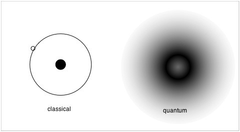

# Quantum Mechanics

## Background to Quantum Mechanics
Quantum mechanics is the study of the physical properties of matter, on the scale of atomic or subatomic particles. 

Classical physics on the other hand studies matter and energy on a macroscopic scale - that is, on a scale that we are more used to seeing in daily life.

<figure markdown>
{ width="500" }
<figcaption>Image courtesy of <a>http://clearlyexplained.com/quantum-mechanics/index.html</a></figcaption>
</figure>

Though the mathematical basis of quantum mechanics is well-agreed upon (and verified through experiments), there exist many different ways to explain how these mathematical theories correspond to our experienced reality. These are known as **interpretations** of quantum mechanics, and there is no consensus on which one "best" represents our reality.

For this series of writeups, we will be explaining using the Copenhagen Interpretation. It is important to note, however, that Heisenberg's Uncertainty Principle still holds no matter which other interpretation is chosen. 

### Brief Introduction to the Copenhagen Interpretation
In day-to-day life, we are used to describing a position with a definite value. If you see a football on the ground, you know the football is there. We say that the position of the football is at that point - exactly where we see it. And no matter how we kick the ball around, we know it will always have a position - it will always be somewhere we can describe with a real "location".

The same doesn't apply to quantum mechanics. Under the Copenhagen interpretation, observable quantities like position have no reality until they are measured. 

A state describes the conditions of a system. In each of these states, an observable quantity (e.g. position) can take on different values - imagine our ball being in various locations on a field. Until a measurement is performed, the system exists as a superposition of these quantum states.

This means the ball seems to be in multiple places at the same time, which is very unintuitive and suggests we need a different way to think about it. Since the ball doesn't always have a definite position where it can be found, we can only describe its location in terms of the probability of finding it in different locations. In other words, quantum theory can only provide us with a probability distribution for a measurement's outcome. 

Of course, if you can SEE the ball, you know where it is. We know intuitively that the act of measurement must only give us one definite, actual value. How then does quantum mechanics explain this? 

This is known as the measurement problem, and the Copenhagen interpretation explains it as follows: When we measure an observable quantity, we are forcing the system into a state where the observable has a single, definite value. This is known as an eigenstate of that observable.

<figure markdown>
{ width="500" }
<figcaption>Animation courtesy of <a>https://www.quantamagazine.org/what-is-a-particle-20201112/</a></figcaption>
</figure>

As a (poorly contrived, but 100% original) analogy, think of a spinning coin. 

Is the coin showing heads or tails? While the coin is still spinning, this question has no meaning - if anything, it's showing neither.

But imagine now we slap the coin with our palm, flat onto the table. When we lift our hand, we will see the coin necessarily shows either heads or tails. The act of measurement has forced it into an eigenstate, in which the observable value is either 'heads' or 'tails'. This is analogous to the wave-function collapse in the Copenhagen interpretation. When we measure a quantity, we suddenly force the system into any of the states that do have a definite value for that quantity. But while we aren't measuring it, the system can continue to exist as a superposition of these states, and the quantity returns to having no definite value.

## Heisenberg's Microscope
Heisenberg's microscope describes the thought experiment that Heisenberg formulated as an introduction to his uncertainty principle. Suppose we wish to determine the position and momentum of an electron, which we will (ironically) treat as a classical particle.

Let the wavelength of the light rays be $\lambda$.
Let the cone of light rays focusing on the electron make an angle $2\theta$ with the electron. 

According to the Rayleigh criterion, we can only resolve the position of the electron to the following accuracy. Our uncertainty in lateral position $\Delta{x}$ is related to the wavelength of light and angle $\theta$ as follows:
$$
\Delta{x}=\frac{\lambda}{2\sin{\theta}}
$$

We also know that when a photon strikes an electron, the electron experiences Compton recoil with momentum proportional to $\frac{h}{\lambda}$. But since the direction of the scattered photon can be anywhere within the cone of light rays, we cannot determine the angle from which the photon collided with the electron! This is illustrated below:

<figure markdown>
{ width="500" }
</figure>

As such, we can only determine the electron's momentum in the x direction with the following accuracy:
$$
\Delta{p}_{x} \approx \frac{h}{\lambda}2\sin{\theta}
$$

Suppose we want to decrease the uncertainty of the position, i.e. decrease $\Delta{x}$.

If we decrease the wavelength of light, we can resolve the position with greater accuracy. But the photon will strike the electron with more momentum and result in even greater uncertainty in the electron's final momentum.

On the other hand, if we increase $\theta$ by widening the microscope's aperture, we can also resolve the position to a greater accuracy (as shown by the Rayleigh criterion). But since the angle the cone of light makes with the electron is larger, the scattered photon could be moving in a wider range of directions. This also increases the uncertainty in the electron's final momentum in the x-direction.

Looking at the equations together, we begin to get a picture of why we cannot perfectly determine both the momentum and the position of an electron. Any action taken to decrease the uncertainty of either momentum or position will increase the uncertainty in the other variable. 

In 1927, Heisenberg used these results to formulate an approximate expression of the uncertainty principle,

$$
\Delta{x}\Delta{p_x} \approx \frac{\lambda}{2\sin{\theta}} \left(\frac{h}{\lambda}2\sin{\theta}\right) = h
$$ 
It would only be later in that year when Earle Hesse Kennard would first prove the inequality we associate with the uncertainty principle today:

$$
\sigma_x\sigma_p\geq\frac{\hbar}{2}
$$

### Confusion with the Observer Effect
Heisenberg's original thought experiment made use of the observer effect (also known as the observer's paradox), in which the act of measurement causes the system to change. Unfortunately, this has led to people incorrectly attributing the uncertainty principle TO the observer effect.

The observer effect is undeniably at play in the act of measurement, but its involvement is limited to the collapse of the wave function (at least, under the Copenhagen interpretation). The uncertainty in our measurements is not a result of the act of measurement introducing error to the system - rather, the uncertainty is intrinsic to all quantum systems. Even if we were to devise a measurement method that did not disturb the system by changing its momentum or position, Heisenberg's Uncertainty Principle would still hold because of the statistical uncertainty of those variables.

### So what does uncertainty mean?
Momentum and position are incompatible observables and are special in that they are canonical conjugate quantities. That is, one is the Fourier transform of the other. Such pairs of variables do not commute, which implies that **no quantum state can simultaneously be a position eigenstate and a momentum eigenstate**. 

In other words, there exists no such preparation of a system such that only one possible value of BOTH position and momentum can be associated with it. If we measure the momentum and force the system into a momentum eigenstate, the state cannot be a position eigenstate - i.e. the value of momentum corresponds to multiple possible states, each with different values of position. There is a limit to how much we can know simultaneously about position and momentum, and this limit is quantified in Heisenberg's Uncertainty Principle.

## Wave Mechanics  
According to the De Broglie hypothesis, all matter has a wave-like nature. In quantum mechanics, the wavefunction gives us the probability amplitudes for observables such as position.

Consider the below animation, which shows a wave packet in position space moving from left to right.

<figure markdown>
{width="300"}
<figcaption>Animation courtesy of WikiMedia</figcaption>
</figure>

At each point for a certain instant in time, the amplitude of the wave in position space gives us the probability of finding the particle at that position. Wave packets such as these are caused by the constructive interference of several component waves over a small region of space, and destructive interference everywhere else.

The principle of quantum superposition states that the quantum state can be represented as a sum of multiple other distinct states.

We can hence think of the above wave packet as consisting of several constituent waves, each of which is associated with a different wavelength. Since they are each associated with only one wavelength (and thus by $\lambda = \frac{h}{p}$, also associated with only one value of momentum), these component waves are eigenvectors of momentum.

When we add more component waves of varying wavelengths, the wave packet above will be more localized and "narrower". This can be interpreted as reducing the spread of probabilities of values for our position and hence reducing its uncertainty.

But with our quantum state now consisting of more varying wavelengths, the uncertainty in the wavelength (and thus momentum) must increase. When we take a measurement, the wave function could be forced to collapse into any one of these constituent eigenvectors, and hence could give us varying values for momentum. We have decreased the uncertainty in position but increased the uncertainty in momentum.

On the other hand, imagine if our quantum state consisted of only one fixed-wavelength wave. Any measurement must give us the same value of momentum, but the probability distribution for its position would be spread out throughout all of the space (consider a regular sine wave). There is now no uncertainty in momentum, but an enormous uncertainty in the position.

This property is not unique to position and momentum. Any two variables that are Fourier transforms of each other (i.e. conjugate variables) will also suffer a similar trade-off. The more concentrated a certain function is, the more spread out its Fourier transform will be.

<iframe width="560" height="315" src="https://www.youtube.com/embed/qsGiB7kq8fA" title="YouTube video player" frameborder="0" allow="accelerometer; autoplay; clipboard-write; encrypted-media; gyroscope; picture-in-picture" allowfullscreen></iframe>