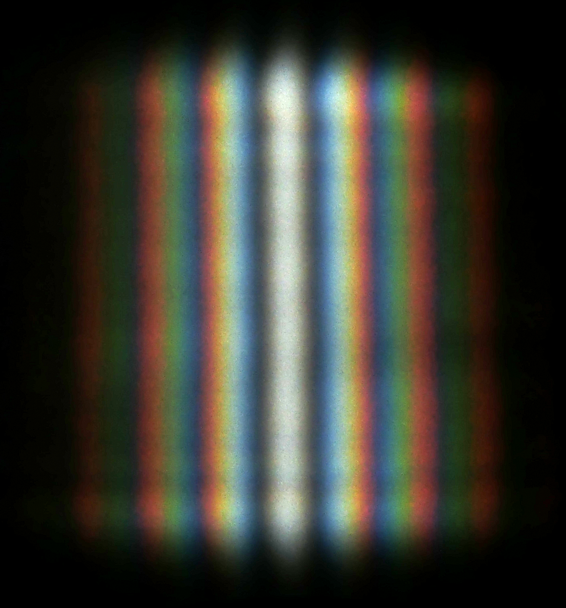
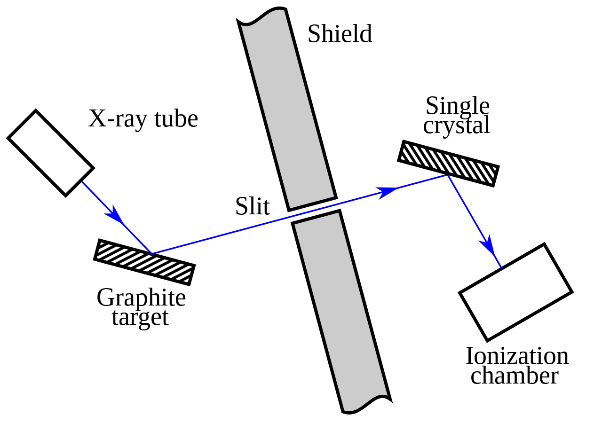

# Wave-particle duality

## The wave theory and blackbody radiation

Before the 20th century, there were numerous theories about the nature of light. One such prominent theory was the wave theory of light. In 1801, this theory was strengthened by the double-slit experiment which showed that light interferes like a wave. Soon, the wave theory became the dominant theory on the nature of light as it could also explain phenomena such as the polarization of light.

{: style="width:300px;display: block; margin: 0 auto"}

However, following the turn of the century, Max Planck found a solution to a pre-existing problem with weird assumptions (at the time). Planck was working on a theoretical model for the wavelengths of light emitted by a blackbody (A theoretical perfect absorber of energy) at given temperatures. Previous attempts used known theories of light and energy and failed to describe the phenomena for higher frequencies this was known as the "ultraviolet catastrophe".

{: style="width:300px;display: block; margin: 0 auto"}

However, Planck was successful because he made rather strange assumptions. One of the key assumptions was that the energy emitted or absorbed by a blackbody was quantised, or in discrete packets as opposed to continuously being emitted or absorbed and that the energy of each packet was described as such

$$E=hf$$

where $h = 6.626 \times {10}^{-34} Js$ (known as Planck's constant) and $f$ is frequency. With this and some other key assumptions Planck was able to determine the formula to explain blackbody radiation.

$$B_{f}(T)={\frac {2f ^{2}}{c^{2}}}{\frac {hf }{e^{hf /kT}-1}}$$

Planck asserted that only the energy of radiating atoms was quantised and not that light itself was quantised and the wave theory while slightly shaken, held strong.

## The electron and the photoelectric effect

Around the same time, JJ Thomson discovered the first subatomic particle known as the electron through the cathode ray experiment. The electron had a negative charge and it was speculated that atoms consisted of a positively charged volume with electrons. This was known as the plum-pudding model.

{: style="width:300px;display: block; margin: 0 auto"}

Delocalised mobile electrons in certain elements and compounds (such as metals and alloys) can move to create a current when there is a voltage difference between regions.

$$I = \frac{dQ}{dt}$$

A few years before the discovery of the electron, Heinrich Hertz observed the photoelectric effect. He saw that when you place 2 metal spheres very close to each and shone light, sparks would be observed between the 2 spheres.

{: style="width:300px;display: block; margin: 0 auto"}

Thompson showed that these sparks were electrons. To explain this classical physicists suggested that the oscillating electric field of the light wave was heating electrons and causing them to vibrate, eventually providing them with enough energy for it to overcome the attraction to the positively charged cloud of the atom. They came to this assumption with the wave theory of light and predicted that the KE of emitted electrons should be proportional to the amplitude of the light wave and that the rate of electron emission (or current) should be proportional to the frequency. However, both these assumptions were proven to be wrong. It was found experimentally that KE increases with frequency and current increases with amplitude. It was also found that for light with low frequency, the effect was not observed regardless of intensity. This was a big shock and brought into question the wave theory of light.

{: style="width:300px;display: block; margin: 0 auto"}

However, Albert Einstein came to the rescue and explained this phenomenon while building on Planck's work. He first realised that unlike what Planck asserted, light itself was quantised and was behaving like it was composed of tiny particles (now known as photons) where each particle had energy proportional to its frequency.

$${E}_{photon}=hf$$

This explained the fact as to why the kinetic energy increased with frequency because since energy could only be transmitted discretely as compared to a continuous wave, only photons with high enough energy were able to free the electrons from the surface when hit regardless of the amplitude of the wave. It also explained why the current increased with amplitude because an increase in amplitude caused an increase in the number of photons hitting the metal surface

{: style="width:300px;display: block; margin: 0 auto"}

Of course, Einstein realised that light could not be just a particle because particles collide and light interferes so he postulated that light consisted of spatially localized, discrete wave packets. These wave packets have properties of both wave and particles because they interfere like waves but are still localised like particles. Einstein also defined the momentum of a photon as such

$$p_{photon}=\frac{E_{photon}}{c}$$

## Compton Scattering

After Einstein's conclusions, another experiment known as the Compton scattering experiment was carried out by Arthur Holly Compton. He found that when you beamed X-rays at a graphene target and made it reflect through a slit at an angle $\theta$ such that it hits a rotating crystal an interesting result would be observed.

{: style="width:300px;display: block; margin: 0 auto"}

It was expected that the wavelength of the light would stay the same after being measured. However, he found that the light would be scattered and the measured wavelengths peaked at either the original wavelength or a new wavelength higher than that of the original.

{: style="width:400px;display: block; margin: 0 auto"}

Compton explained his findings by hypothesising that the scattering was observed because the individual photons of the x-ray were hitting the electrons of the crystal target. This explains the increase in wavelength as some of the energy of the photon would be transferred to the electron causing its frequency to decrease and its wavelength to increase. The electron also experienced an increase in momentum proportional to $\frac{h}{\lambda}$ further strengthening his hypothesis. Using this, he developed a theoretical model for his empirical data.

$$\lambda '-\lambda ={\frac {h}{m_{e}c}}(1-\cos {\theta })
$$

He found that his model fit the data and he showed that electron's have particle-like properties in that they can collide like particles and the momentum was conserved in photon-electron collisions.

## de Broglie's hypothesis

In 1924, French Physicist Louis De Broglie came up with the idea that all matter exhibits both wave and particle properties and that the wavelength of a particle is related to its momentum in the following way

$$\lambda = \frac{h}{p}$$

This equation is the same as einstein's equation but applied to matter. In 1927, his theory was further confirmed by 2 different experiments.

### Electron Diffraction

Diffraction is the spreading out of waves through an aperture or around objects. It occurs when the size of the aperture or object is the same order of magnitude as the wavelength of the wave. Visible light has wavelengths of magnitude $100 \, nm$. Hence, the slit width was relatively wide. When multiple slits or ridges are placed at regular intervals, it is called a diffraction grating and forms an interference pattern due to the repeated constructive and destructive interference of waves.

{: style="width:300px;display: block; margin: 0 auto"}

The same was shown for electrons in the electron diffraction experiment carried out during carried out by George Thomson (Son of JJ Thomson) in 1927. This was difficult to show as the electron's wavelength is very small. If we accelerate the electron across a potential difference, we know that

$$
K=\frac{p^2}{2m}=q_eV
$$

If we apply the wavelength equation from earlier, we see that

$$
\lambda = \frac{h}{\sqrt{2 m V q_e}}\\
\lambda = \frac{1.228}{\sqrt{V}} nm
$$

For an accurate result, the electrons would have to be accelerated at high velocities, which is why the voltages used were in kilovolts. Hence, the wavelength of the electron would have a magnitude of $100 \, pm$. For context, the width of a helium atom is $62 \, pm$.

{: style="width:400px;display: block; margin: 0 auto"}

Hence, to account for this problem, Thomson used a thin piece of graphene which has a hexagonal structure as his grating. The graphene ring has a side length of $0.142\,nm$ making it a perfect diffraction grating for this problem.

{: style="width:500px;display: block; margin: 0 auto"}

In the simplified diagram above, electrons are beamed through a thin graphene sheet. it was shown that the electrons formed an interference pattern similar to that of diffraction with a circular aperture which was consistent with Bragg's law. This showed that electrons exhibited wave-like properties in that they constructively and destructively interfered like waves.

### Davisson-Germer Experiment

The Davisson-Germer Experiment showed a similar result with a slightly different setup. Electrons were beamed at a Nickel target at various angles and the intensity was measured with a movable detecto

{: style="width:300px;display: block; margin: 0 auto"}

In this case, the electrons are reflected off of Nickel. They found that the intensity of the light measured peaked at certain angles which were once again consistent with Bragg's law. This is because Nickel has a lattice-like structure formed by its atoms and the lattice spacing is small enough to cause diffraction.

## Conclusion

By 1927, wave-particle duality was shown for both matter and light. Around that same time, Heisenberg was developing his matrix mechanics for quantum mechanics. He was developing this system because at that point the motion of an electron was more spread out in a strange way as compared to being completely deterministic. However, through his calculations, Heisenberg found something shocking about the nature of matter and light.

